# HACK THE BOX - BEEP WRITEUP

Lets enumerate the box with nmap

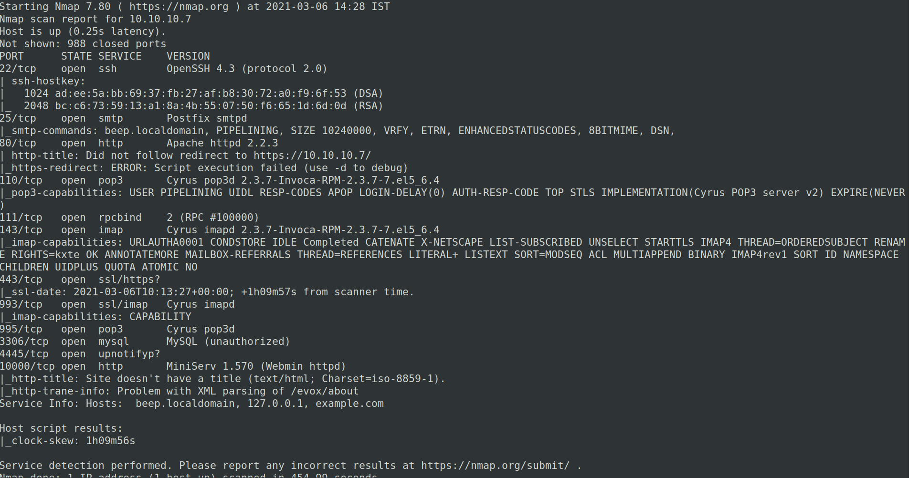

We can see many ports open,

First lets enumerate the web service

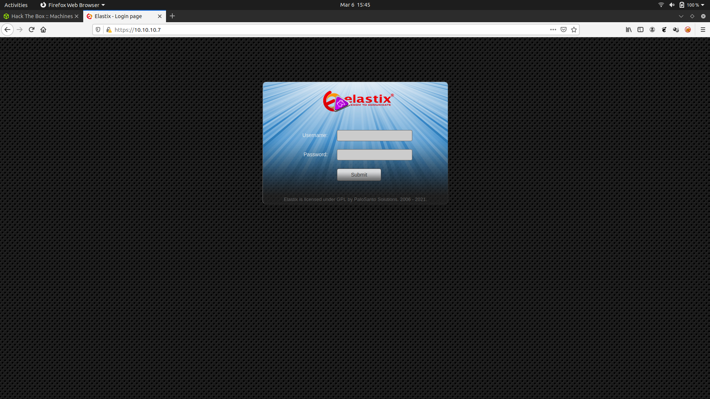

Here we can see,this web service use "Elastix" CMS

Lets search for exploits available in Searchsploit

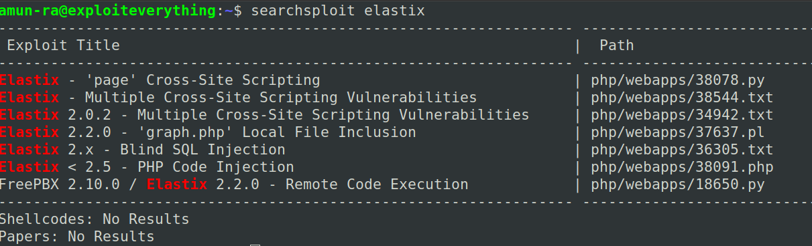

Here using XSS and SQLi we could not get valid credentials

PHP Code Injection and RCE is also not possible because we could not bypass the Login panel

So its best to try LFI(Local File Inclusion)

Analyzing the exploit script,

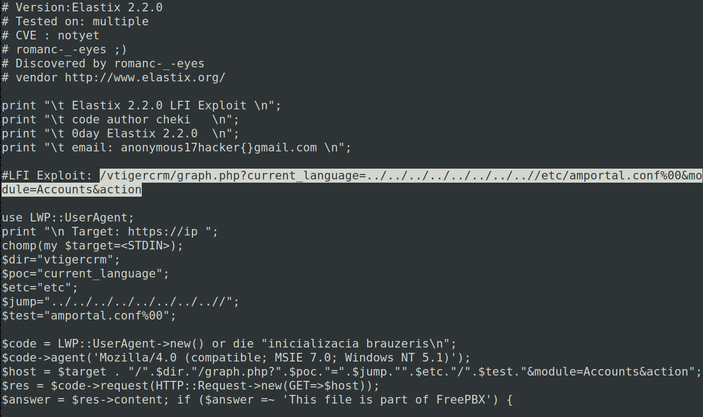

We can see credentials from the LFI path provided in the exploit

Running it in the browser,we get

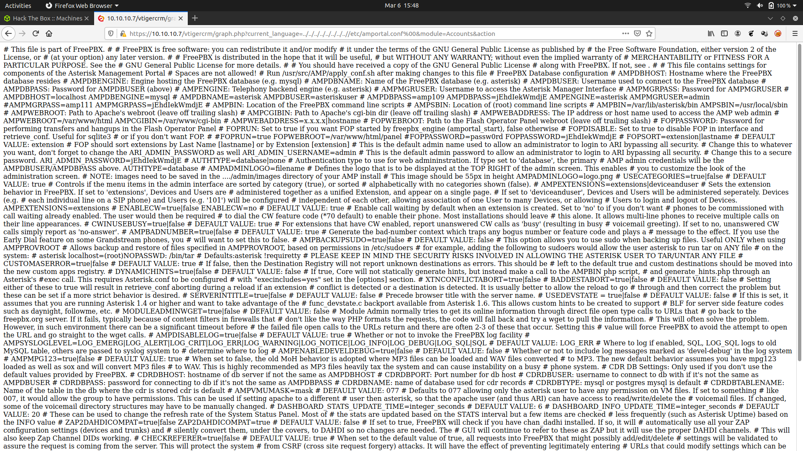

Analyzing it with "View Page Source",we can see it in pretty form

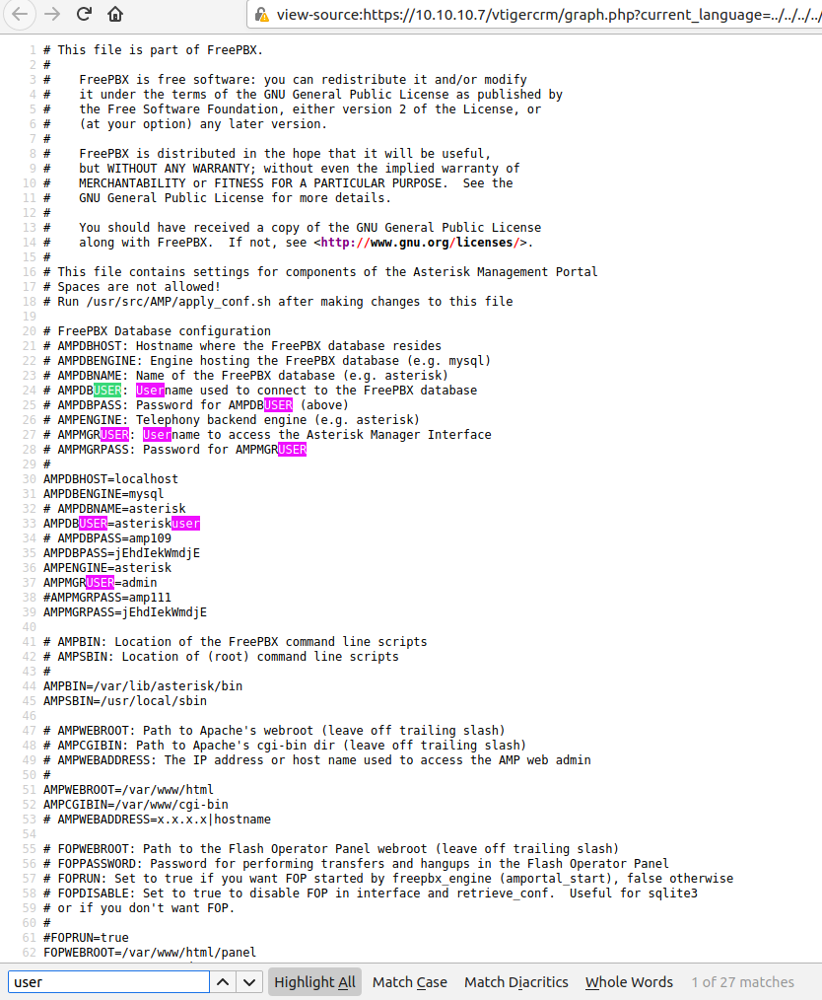

Using find to search for "Username" and "Password" combinations

But using the credential "admin:jEhdIekWmdjE" we could login the CMS

Unfortunately there is no info in it

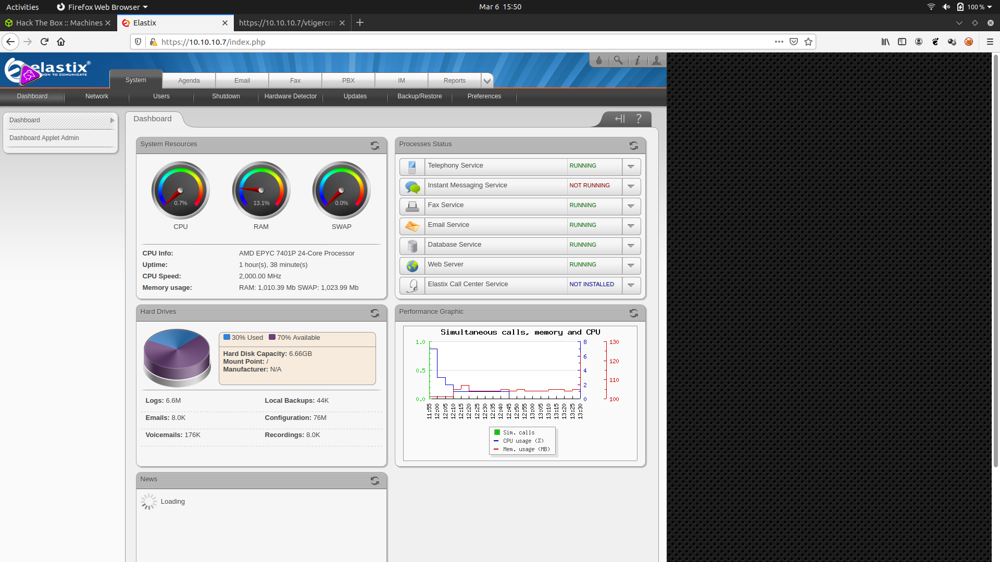

We can try LFI to access other files to gather username for the box

For /etc/shadow

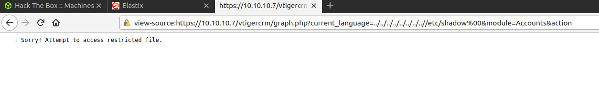

For /etc/passwd

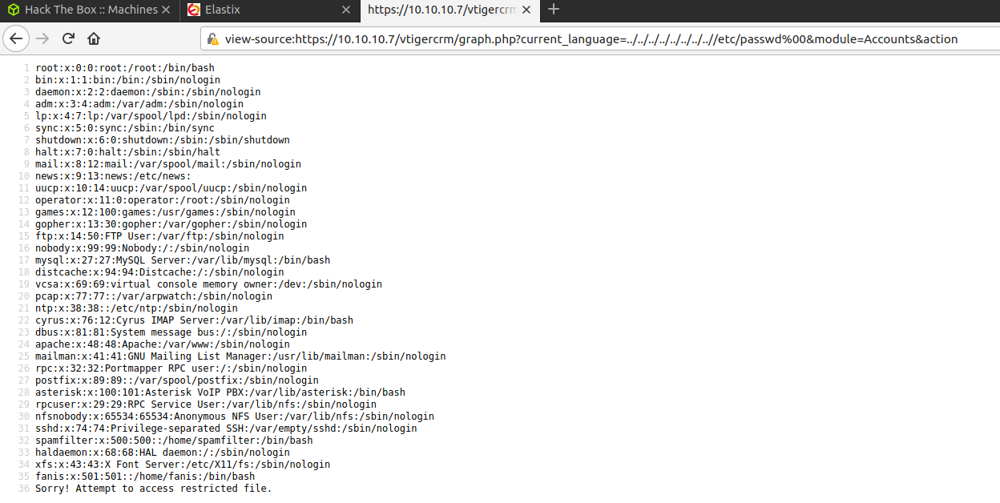

We cant be so sure for a particular combination

So lets use these combinations to find a valid login credentials using "BruteForce Attack"

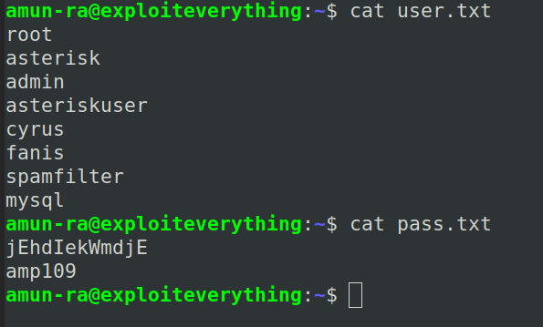

To perform a bruteforce attack we use "Hydra"

We should perform it on "SSH" since there is no other protocol which uses authentication

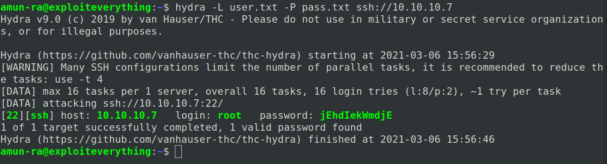

After brute forcing we got a valid login credential

"root:jEhdIekWmdjE"

Lets login through SSH with these creds

We cannot login through SSH, because it uses different Key Exchange Algorithm

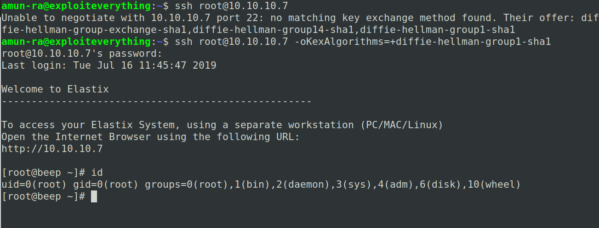

After logging in, we are in #ROOT shell

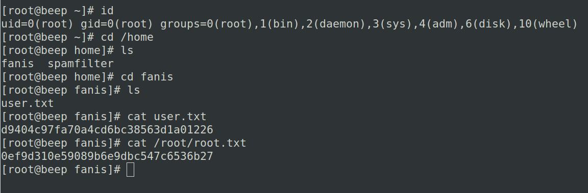

Get the flags

