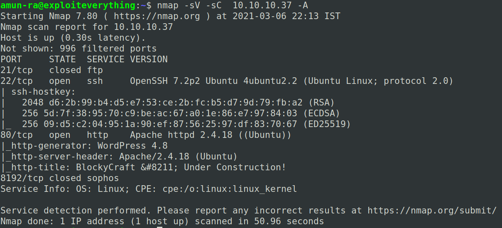
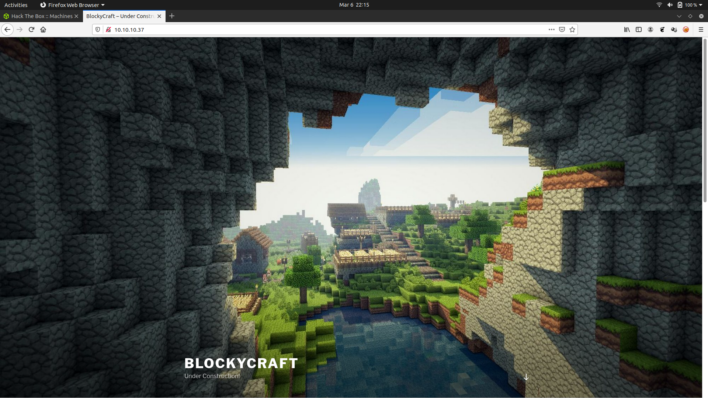
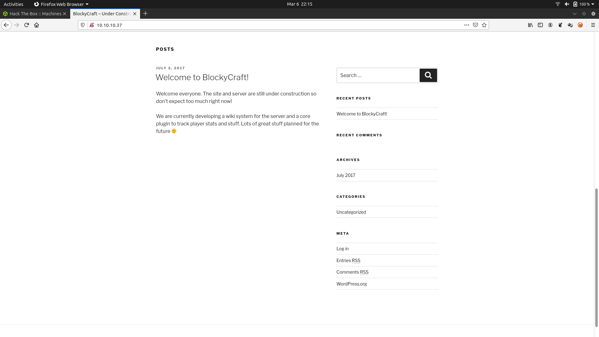
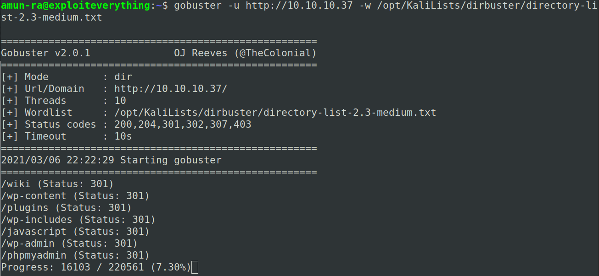
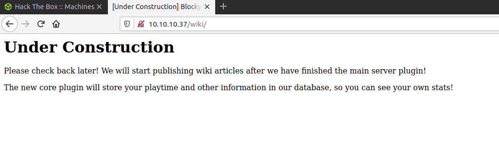
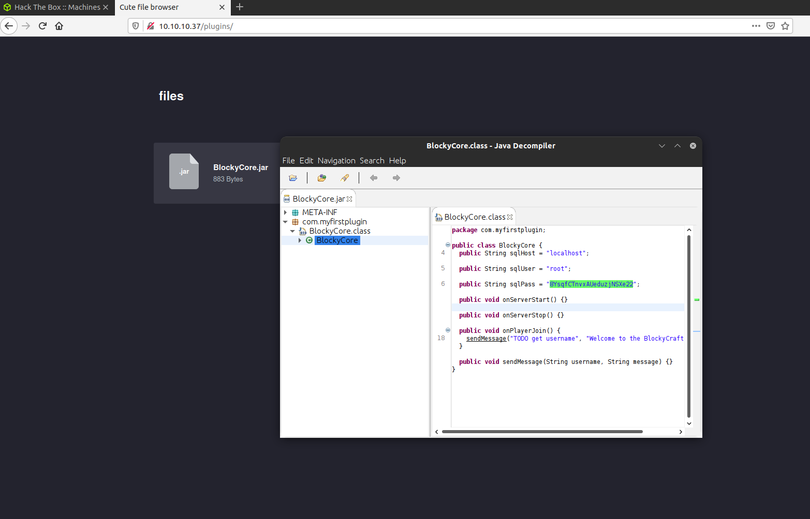
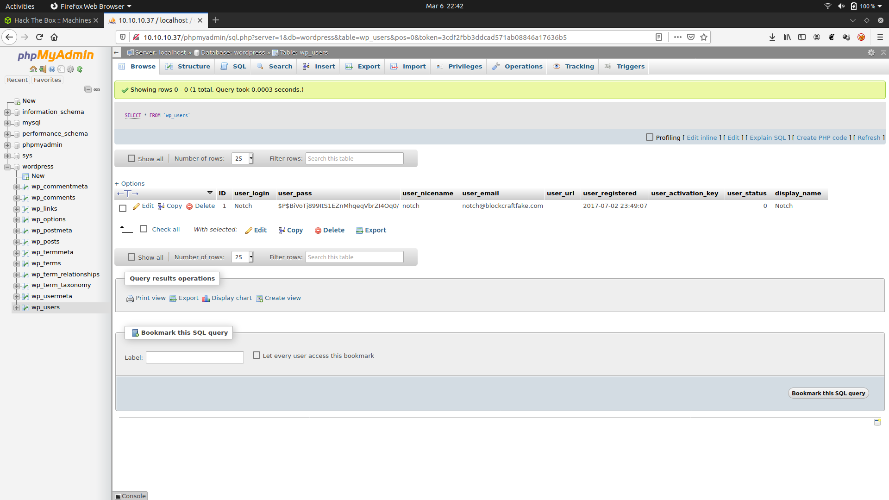
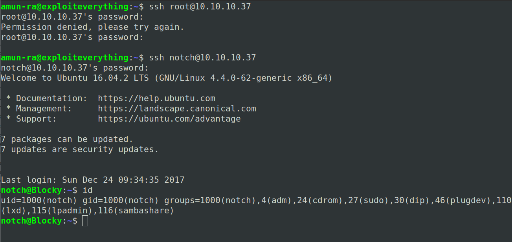
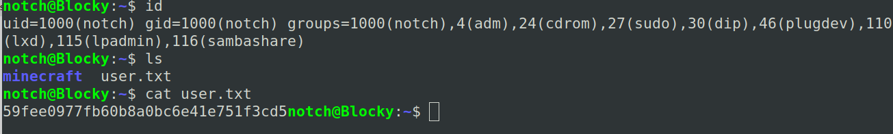
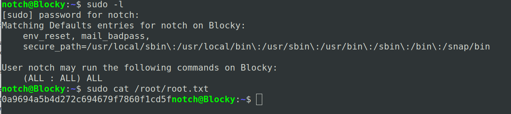

# HACK THE BOX - BLOCKY WRITEUP

Lets enumerate the box with nmap 

We can see,

FTP is closed

SSH needs creds

Port80 runs a web service

And some irrelevant port

Lets visit the port80

Scrolling down,it seems like a WP page

Lets run gobuster to find the hidden directories

Lets visit the first directory "/wiki"

It gives us a hint to visit "/plugins"

Here there are two Java JAR files stored in this directory

Download this and decompile it and view its source code

I prefer "JD-GUI" for this method

Download Link: http://java-decompiler.github.io/

By analyzing it you can see it contains password for "root"

Now,using these creds lets try logging in "/phpmyadmin"

We can see many DB, go to "wordpress" and "wp-users"

View the table,

You can see a user named "Notch" with his password hashed

So lets try logging it with SSH

Tried logging for "root" with the password accquired from JD-GUI,it failed

We got SHELL

Now lets get user

Now lets try to escalate our privileges to get root

We can run any program using "notch" with "sudo"

Own the box

