# HACK THE BOX - DEVEL WRITEUP

Lets enumerate the box with nmap

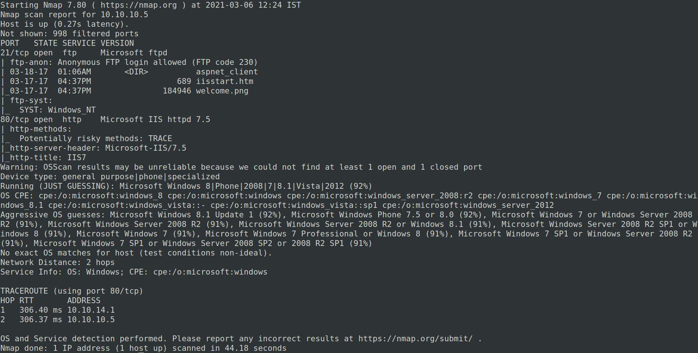

Since Anonymous FTP Login is allowed

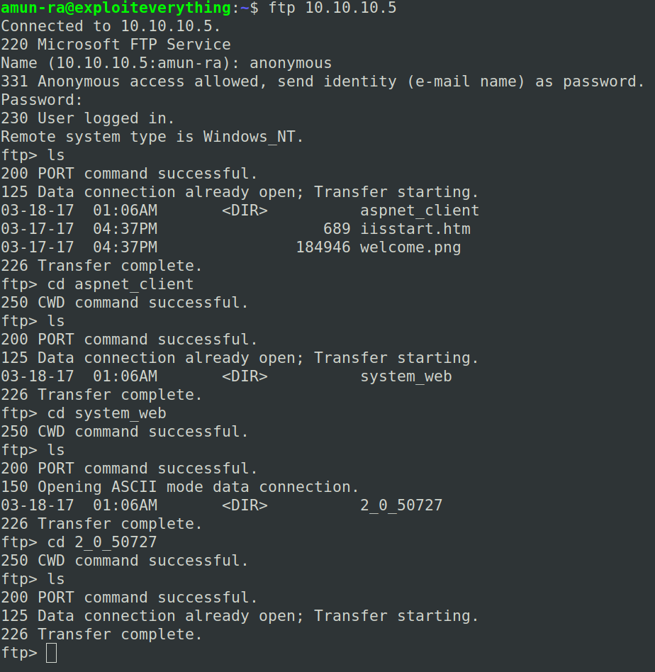

No useful info from that

Lets check the website

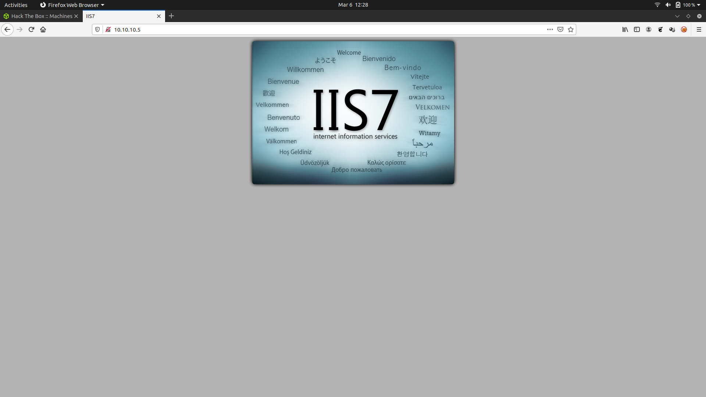

Lets use Gobuster to find directories

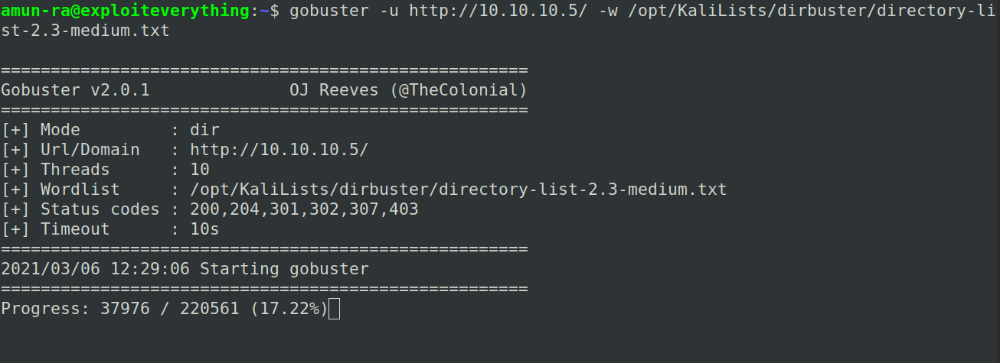

No useful directories from the wordlist

Lets search for any exploit in Searchsploit

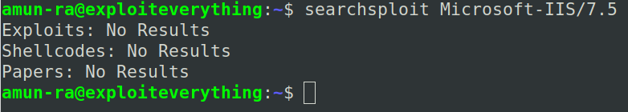

And analyzing the source code from the website's main page

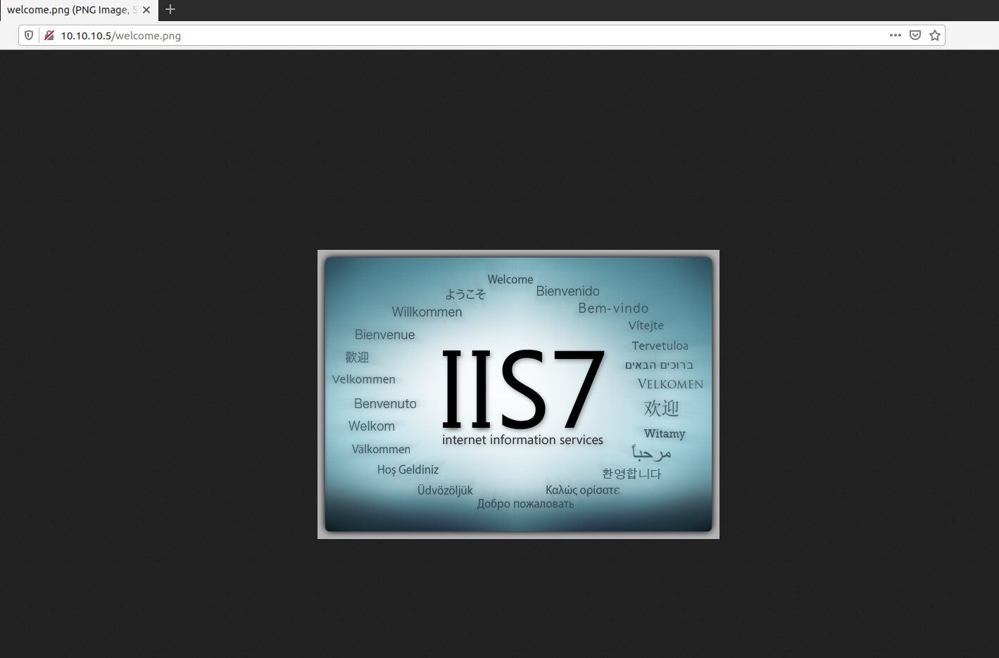

We can see that "Welcome.png" from the FTP directory

So the website is in running from FTP Root Directory

Lets see we can upload a file in FTP Anonymous login

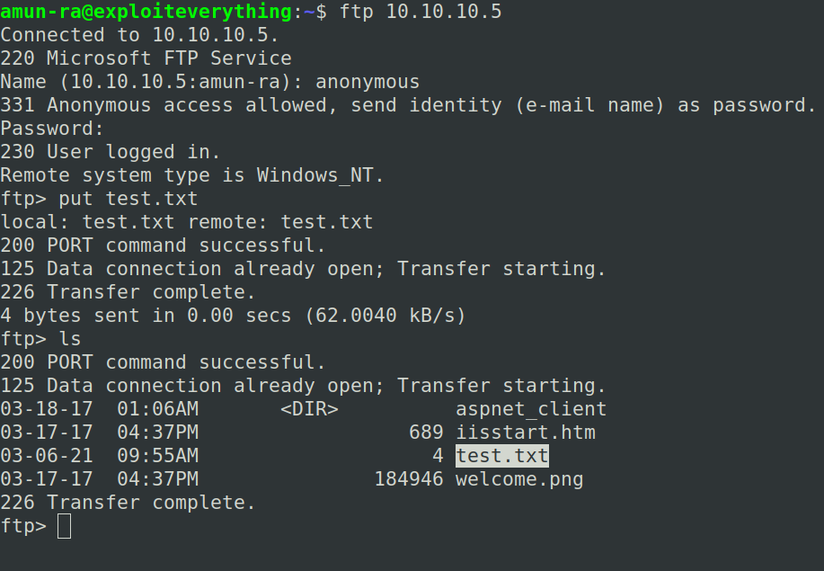

So we can upload files, lets try uploading a aspx shell since its running in asp_client

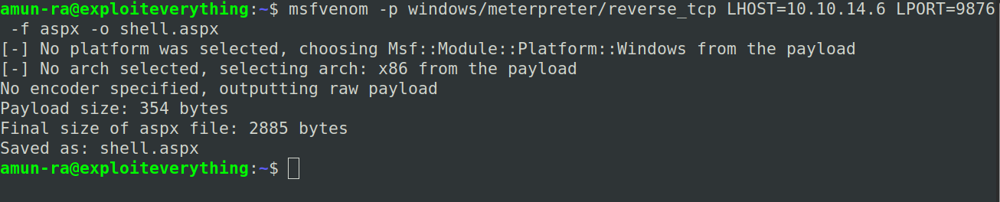

Configuring our listener

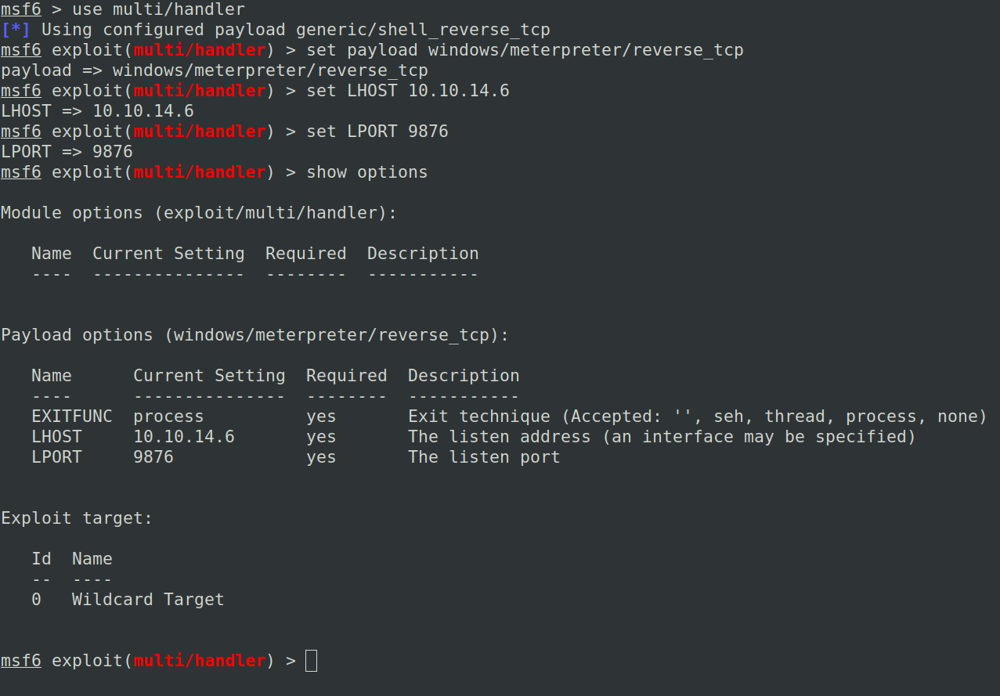

Now,lets upload our shell.aspx to FTP

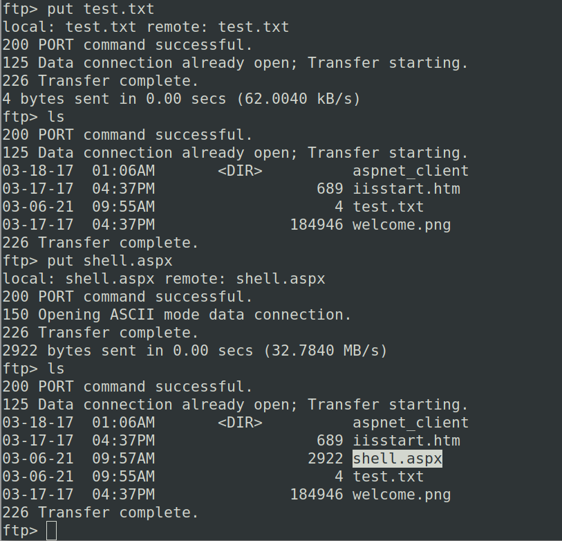

Loading the page in website triggers the reverse shell and starts the meterpreter stage

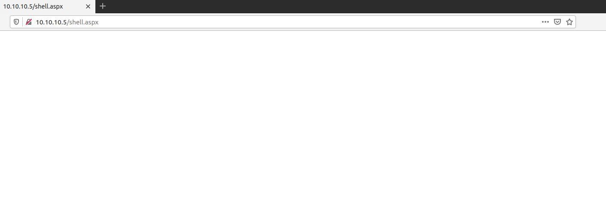

We got SHELL

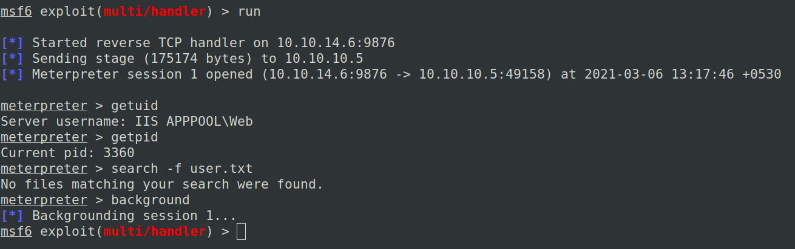

Here we are in the "APPPOOL/WEB" user,

Which is not a privileged user

So lets try the "local exploit suggester" to find a suitable exploit for privilege escalation

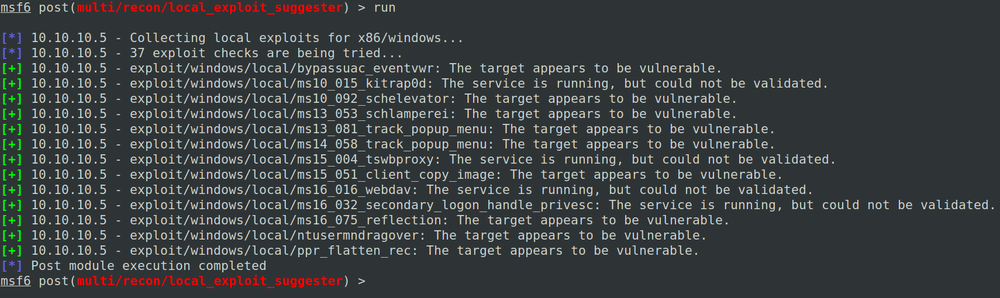

Here we can see many exploits shown as vulnerable

But some of the exploits are false positive

We cannot blindly follow a particular exploit

So lets do trial and error to cross check these

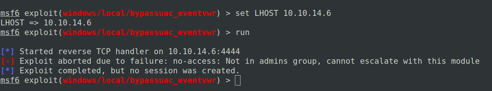

So our first suggested exploit "bypassuac_eventvwr" got failed.

So its a false positive

Lets go for our second exploit

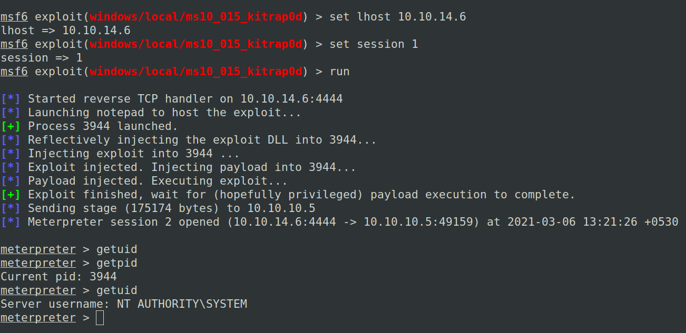

In this exploit "ms10_015_kitrap0d" we got a meterpreter shell

And the user is "NT AUTHORITY/SYSTEM"

Which is a "Admin" level privileged user

Lets hunt for flags

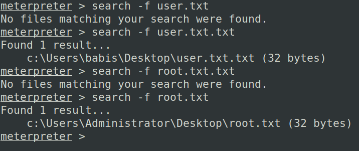

User flag

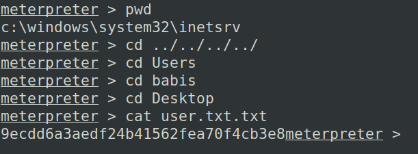

Root flag

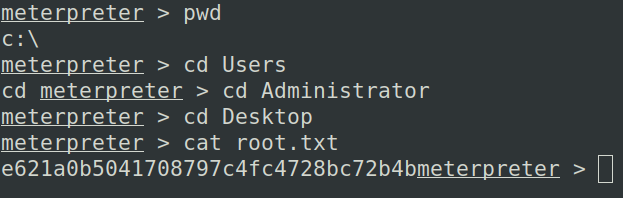

Own the box