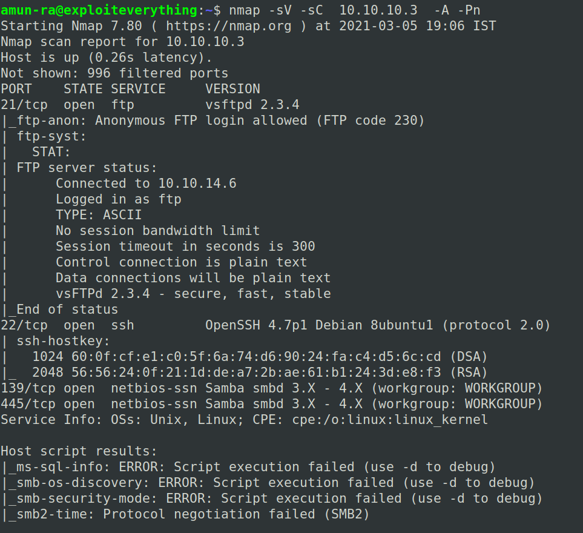
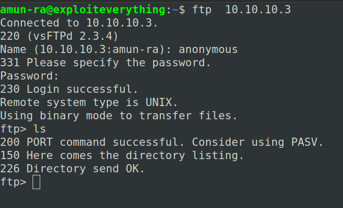
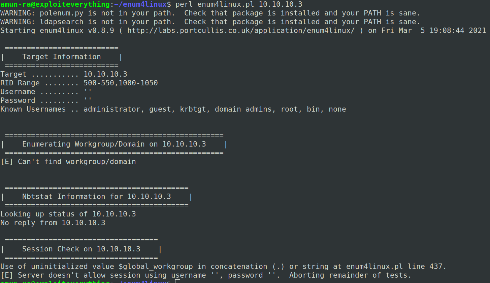
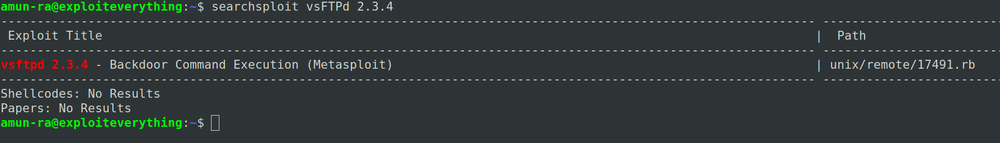
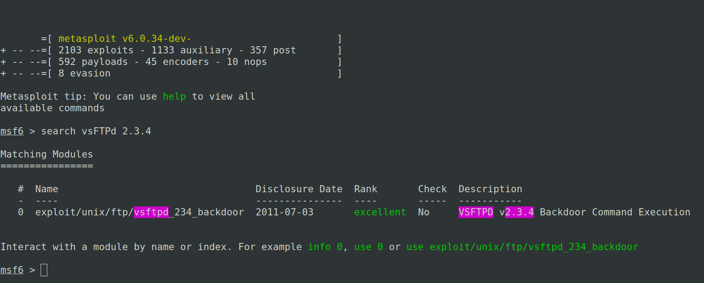
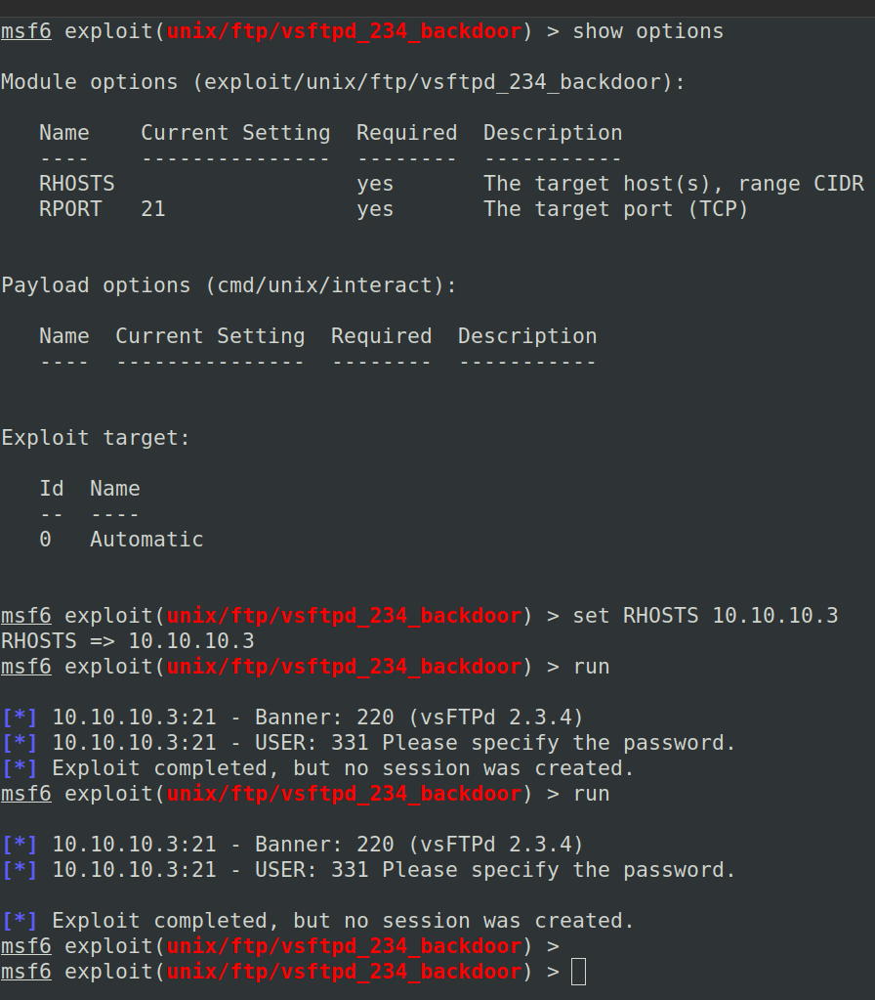
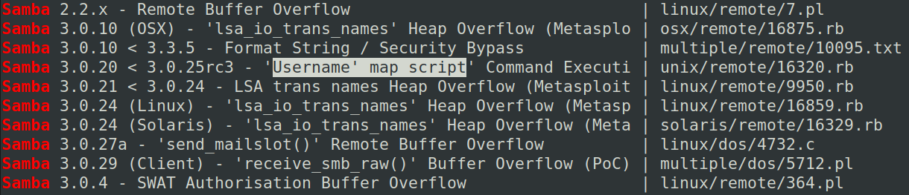
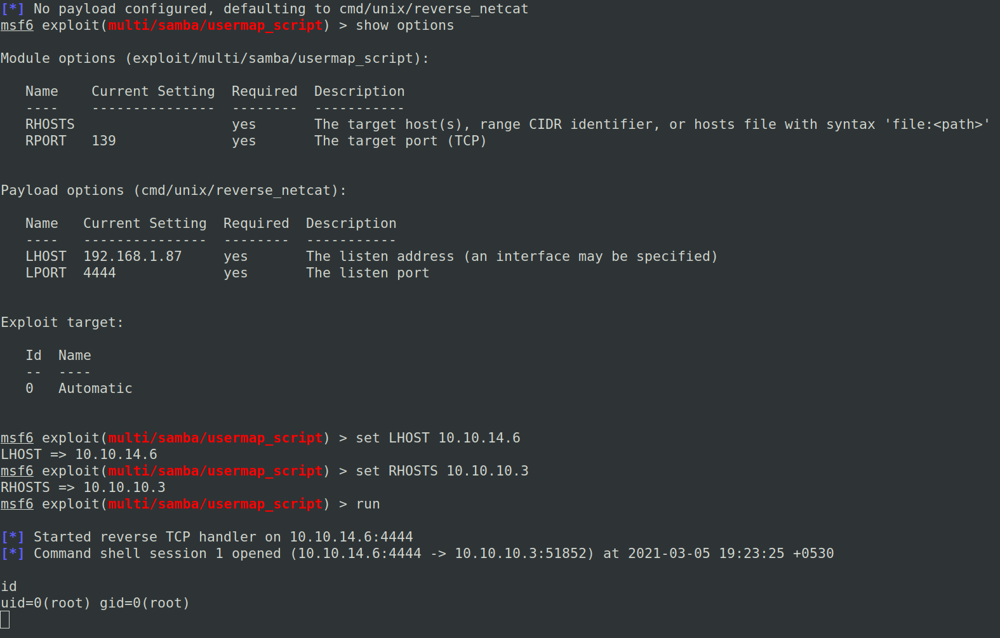
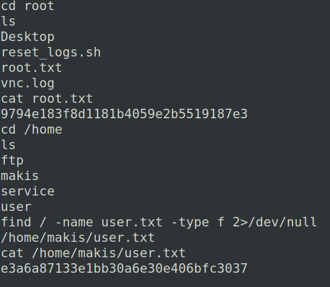
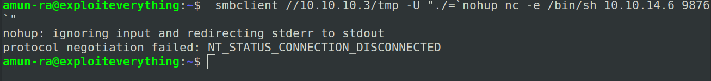

# HACK THE BOX - LAME WRITEUP

This is an easy linux box based on CVE

Scan and enumerate the machine with nmap

Here we can see,

FTP,SSH & Samba ports are open

Obviously we can see that FTP has enabled Anonymous login

So lets check for any info on that

No usefule info,just a rabbit hole

Lets use enum4linux to enumerate SAMBA

NOTE:
Whenever you see a SAMBA port,try to enumerate with 'enum4linux'
enum4linux is a best tool used for SAMBA Recon and AD attacks

We didn't get any info from SAMBA also

It seems like there is an authentication problem

Lets search for vsFTPd in searchsploit

There is an famous backdoor exploit..lets try this in metasploit

Configure the options and start the exploit

It doesn't work

So lets search an exploit from SAMBA in searchsploit

Here we can see a popular exploit form SAMBA which is in the given version range,lets try this

Lets configure and run the exploit 

We got $SHELL

Lets get our flags,

Although we used metasploit for this shell,

We can also get shell through Netcat using a command passed through the metasploit exploit

If there is correct authentication on SAMBA,

You can pass this to get a reverse shell

INFO:
The nohup command executes another program specified as its argument and ignores all SIGHUP (hangup) signals. SIGHUP is a signal that is sent to a process when its controlling terminal is closed.

