# HACK THE BOX - LEGACY WRITEUP

Lets enumerate the box with nmap

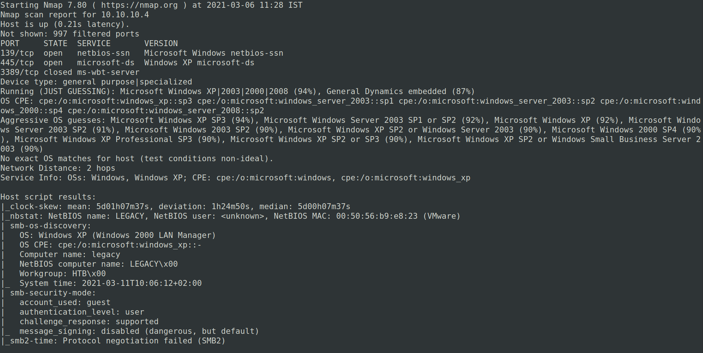

We can see 2 ports are open

And we have a SAMBA port

Lets enumerate the SAMBA port with "smbmap"

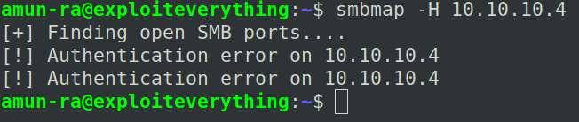

It seems like an authentication failure

Using enum4linux and smbclient results the same

Since it is a Windows box, there is a high chance of having SAMBA exploits

So lets scan for vulnerabilities in nmap

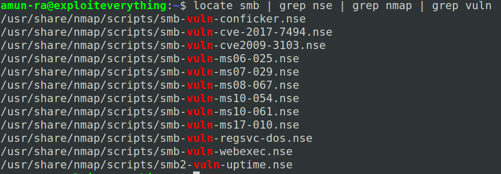

These are all the "nse" scripts available for scanning SMB vulns using nmap

Lets run the scan

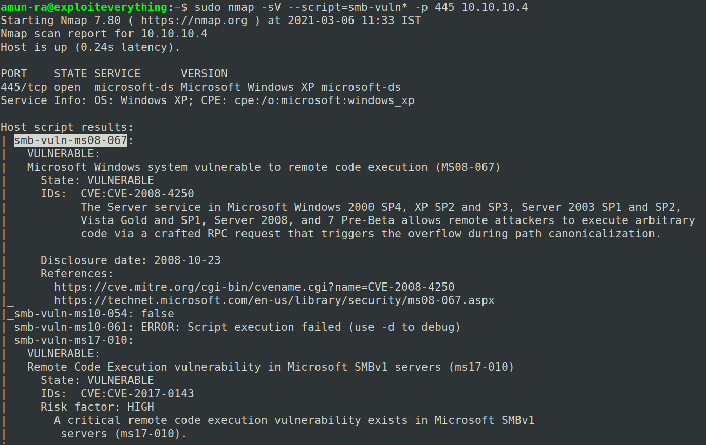

Here we got "smb-vuln-ms08-067" VULNERABLE

Lets use this exploit from metasploit,

You can also use custom exploit from ExploitDB,Searchsploit

But i prefer metasploit because its well maintained

Lets search the exploit in metasploit

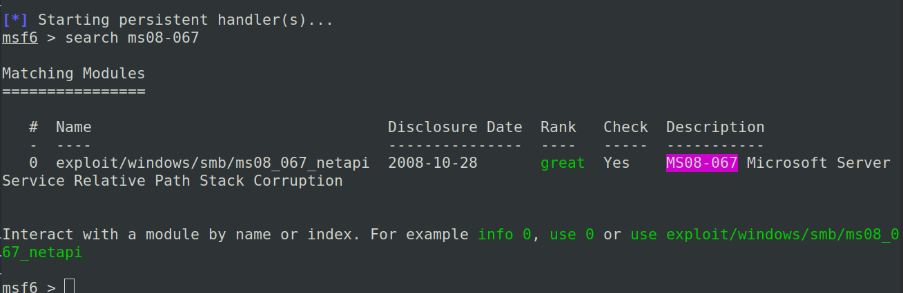

Configure the exploit

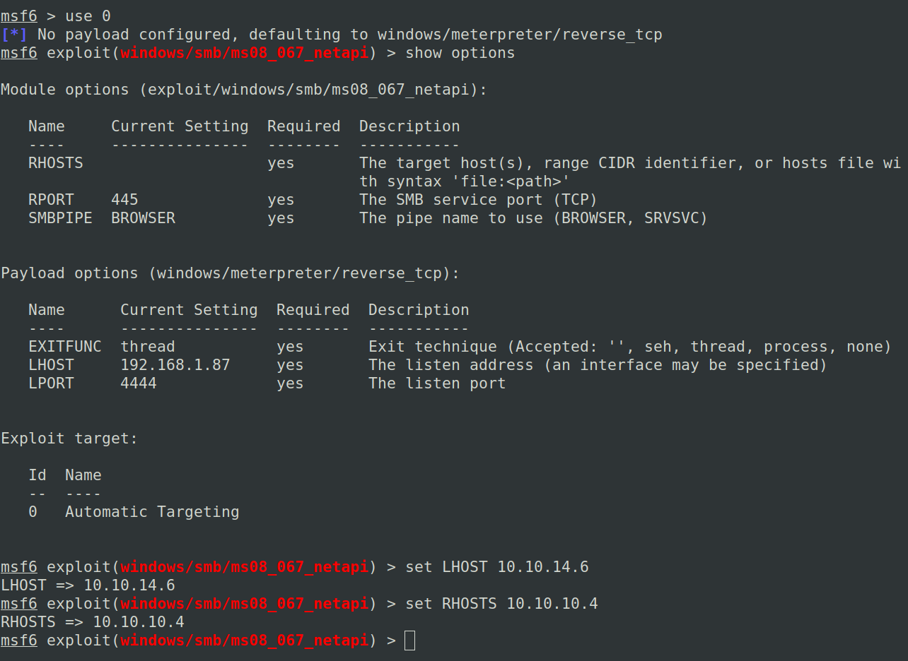

Run the exploit 

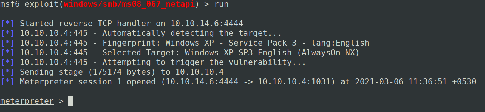

We got the SHELL

Lets check the privileges

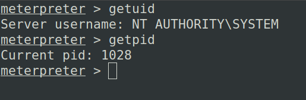

We are in "NT AUTHORITY/SYSTEM"

Which is an admin level privilege

Lets scan for our flags

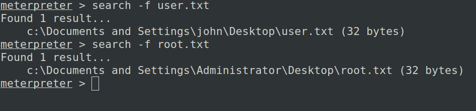

Hunt the flags

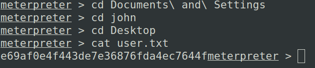

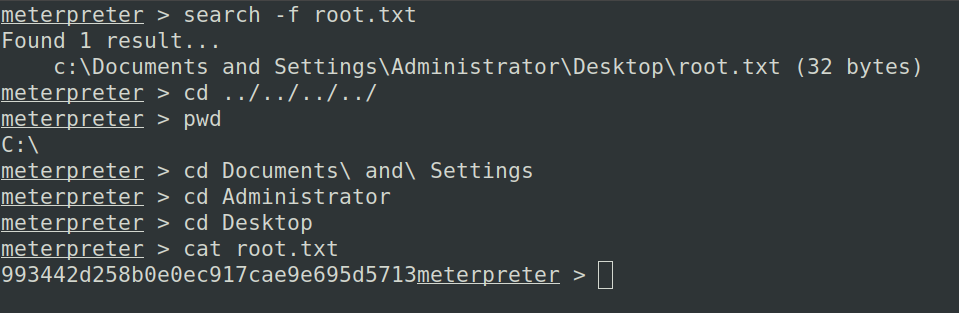

Own the box
